# ResolveIQ

> **Autonomous AIOps Incident Intelligence, Structured RCA & SRE Mission Control Platform**

[](https://openjdk.org/)
[](https://spring.io/projects/spring-boot)
[](https://spring.io/projects/spring-ai)
[](https://nextjs.org/)
[](https://www.typescriptlang.org/)
[](https://www.python.org/)
[](https://www.postgresql.org/)
[](https://kafka.apache.org/)
[](LICENSE)

**ResolveIQ** is an enterprise-grade, multi-tenant AIOps platform that transforms raw distributed OpenTelemetry streams into correlated incidents, deterministic evidence bundles, and structured root cause analyses (RCA). Built as an architectural bridge between high-volume operational telemetry and human Site Reliability Engineering (SRE) decision-making, ResolveIQ ingests metrics, logs, and traces, detects anomalies with zero runtime LLM dependency, constructs runtime service dependency graphs, and executes bounded, read-only AI investigation loops grounded strictly in verifiable systems evidence.

---

## Table of Contents

- [1. What is ResolveIQ?](#1-what-is-resolveiq)
- [2. Why ResolveIQ?](#2-why-resolveiq)
- [3. How ResolveIQ Works](#3-how-resolveiq-works)
- [4. Complete End-to-End Incident Flow](#4-complete-end-to-end-incident-flow)
- [5. Customer Authentication & Access Workflow](#5-customer-authentication--access-workflow)
  - [Customer Registration Lifecycle](#customer-registration-lifecycle)
  - [Passwordless OTP Login Experience](#passwordless-otp-login-experience)
  - [Internal Admin Review & Approval](#internal-admin-review--approval)
  - [Internal SRE vs. Customer Access Separation](#internal-sre-vs-customer-access-separation)
- [6. Security & Multi-Tenancy Architecture](#6-security--multi-tenancy-architecture)
  - [Security Architecture Visual](#security-architecture-visual)
  - [Core Security Invariants](#core-security-invariants)
- [7. Incident Intelligence Pipeline](#7-incident-intelligence-pipeline)
  - [Telemetry Ingestion & Stream Processing Flow](#telemetry-ingestion--stream-processing-flow)
  - [Deterministic Anomaly Detection](#deterministic-anomaly-detection)
  - [Dynamic Topology & Multi-Signal Correlation](#dynamic-topology--multi-signal-correlation)
  - [Evidence Builder Service & Incident Assembly](#evidence-builder-service--incident-assembly)
  - [Multi-Channel Notification Pipeline & Webhook Security](#multi-channel-notification-pipeline--webhook-security)
- [8. AI Investigation Architecture](#8-ai-investigation-architecture)
  - [Spring AI Integration & Tool Registry](#spring-ai-integration--tool-registry)
  - [Investigation Loop & Safeguards](#investigation-loop--safeguards)
- [9. Historical Intelligence & RAG](#9-historical-intelligence--rag)
  - [Hybrid Retrieval (pgvector + BM25)](#hybrid-retrieval-pgvector--bm25)
  - [Clarifying Spring AI vs. pgvector](#clarifying-spring-ai-vs-pgvector)
- [10. Technology Stack](#10-technology-stack)
- [11. Technology to Purpose Mapping](#11-technology-to-purpose-mapping)
- [12. Incident Lifecycle State Machine](#12-incident-lifecycle-state-machine)
- [13. System Architecture & Storage](#13-system-architecture--storage)
- [14. Repository Structure](#14-repository-structure)
- [15. Local Development & Dual-Mode Execution](#15-local-development--dual-mode-execution)
- [16. Running the Simulator & Canonical Demo](#16-running-the-simulator--canonical-demo)
- [17. Testing & Verification](#17-testing--verification)
- [18. Local vs. Production Architecture](#18-local-vs-production-architecture)
- [19. Empirical Benchmarks & Verification](#19-empirical-benchmarks--verification)
- [20. Known Limitations & Production Deployment](#20-known-limitations--production-deployment)
- [21. Roadmap & License](#21-roadmap--license)

---

## 1. What is ResolveIQ?

Modern cloud architectures operate hundreds of microservices emitting millions of telemetry points every second. When an outage occurs:
1. **Cascading Alert Storms**: A failure in a downstream database triggers dozens of simultaneous 5xx, latency, and queue alerts across unrelated services.
2. **Fragmented Context**: SREs scramble across disconnected dashboards—Grafana for metrics, OpenSearch for logs, Jaeger for traces, GitHub for code diffs, and wiki docs for runbooks.
3. **Escalating MTTR**: Over 80% of incident triage is spent isolating *which* service failed and *why*, delaying remediation.
4. **The AI Reliability Gap**: Blindly feeding raw logs into generative AI leads to hallucinated causes, prompt injection risks, and uncontrolled token loops.

ResolveIQ establishes a disciplined division of responsibility:
* **Deterministic Detection & Correlation (Zero LLM)**: Real-time anomaly detection and topology correlation are 100% deterministic, governed by statistical models (EWMA, 3-sigma bands, rolling variance) and dynamic trace DAGs. An LLM outage will **never** prevent ResolveIQ from alerting or grouping incidents.
* **Bounded, Evidence-Grounded AI Investigation**: When an incident forms, ResolveIQ triggers an AI agent equipped exclusively with 11 read-only, authorization-checked tools. The agent cannot execute shell commands, mutate configurations, or run arbitrary SQL. Every claim in the Structured RCA must reference persisted database evidence IDs.
* **First-Class Uncertainty**: When telemetry is sparse or ambiguous, the AI agent is explicitly constrained to state `insufficientEvidence = true` rather than guess.

---

## 2. Why ResolveIQ?

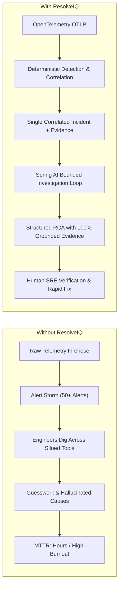

* **No Alert Flapping**: Deterministic SHA-256 anomaly fingerprinting and 15-minute hysteresis prevent alert fatigue.
* **100% Grounded Hypotheses**: Root cause candidates link directly to metric spikes, log clusters, and commit diffs.
* **Tamper-Immune Multi-Tenancy**: Tenant boundaries are enforced via PostgreSQL Row-Level Security (RLS) policies and HMAC-signed JWTs.
* **Human-in-the-Loop Safeguards**: Human verification decisions (`VERIFIED`, `REJECTED`, `NEEDS_MORE_EVIDENCE`) are immutable and permanently recorded in audit logs.

---

## 3. How ResolveIQ Works

The diagram below illustrates the architectural journey through ResolveIQ, showing clear boundaries between user identity, presentation, security context, application APIs, deterministic intelligence, bounded AI investigation, and operational resolution:

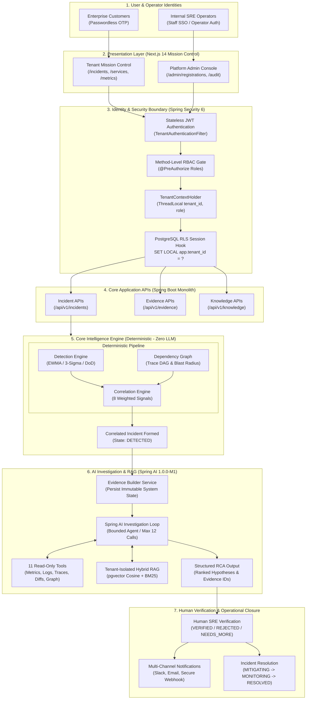

---

## 4. Complete End-to-End Incident Flow

The flagship architecture diagram below illustrates the comprehensive internal journey of data and control through ResolveIQ, connecting distributed telemetry ingestion, Kafka stream processing, dual storage, deterministic detection, topology correlation, evidence persistence, Spring AI bounded investigation, hybrid RAG, human verification, notifications, and closed-loop knowledge retention:

```mermaid
flowchart TD
    subgraph S1_Ingestion["1. Telemetry Ingestion & Edge Sanitization"]
        direction TB
        Sources["Telemetry Sources<br/>(Metrics, Logs, Distributed Traces)"] -->|"OTLP over gRPC :4317 / HTTP :4318"| OTLP["OTLP Receiver (Port 8081)<br/>(Ingestion Service Core)"]
        OTLP --> PreFilter["Edge Ingestion Pipeline Guards<br/>1. Token-Bucket Rate Limiter (Per-tenant burst buffer)<br/>2. Tenant Identity (Argon2id Salted Key)<br/>3. PII & Secret Redaction (High-entropy regex)<br/>4. Idempotency & De-duplication Check"]
        PreFilter --> KafkaProd["Kafka Producer<br/>(Partition Key: tenant_id:service_id)"]
    end

    subgraph S2_TransportStorage["2. Transport, Stream Processing & Dedicated Storage"]
        direction TB
        KafkaProd --> KafkaTopic["Apache Kafka Message Bus<br/>(telemetry.metrics, telemetry.logs, telemetry.traces)"]
        KafkaTopic --> Consumers["Stream Processors (Watermarked 60s Tumbling Windows)"]
        Consumers -->|"Aggregated Metric Points"| Timescale["TimescaleDB Hypertables<br/>(metrics_raw, 1m/5m/1h Continuous Aggregates)"]
        Consumers -->|"Structured Logs & Spans"| OpenSearch["OpenSearch 2.11 Cluster<br/>(logs-index Hot/Cold ISM, traces-index)"]
    end

    subgraph S3_Detection["3. Deterministic Anomaly Detection (Zero LLM)"]
        direction TB
        Timescale --> DetEngine["Deterministic Detection Engine Matrix<br/>• Rule Detectors: 5xx Surge, Latency p95/p99 Breach, Saturation<br/>• Statistical Detectors: EWMA Baseline, Rolling 3-Sigma, DoD Drift"]
        DetEngine --> AnomEval["Anomaly Evaluator & Severity Classifier"]
        AnomEval --> Fingerprint["SHA-256 Fingerprinting & Dual-Threshold Hysteresis"]
        Fingerprint --> AnomEvent["Published AnomalyDetected Event"]
    end

    subgraph S4_Correlation["4. Dynamic Topology & Multi-Signal Correlation"]
        direction TB
        OpenSearch -->|"Trace Call Spans"| TopoGraph["Runtime Trace Dependency Graph<br/>(Tarjan Cycle Detection & Blast Radius Analysis)"]
        AnomEvent & TopoGraph --> Correlator["Multi-Signal Correlation Engine<br/>(8 Weighted Signals: Topology, Time, Traces, Errors, Deploys)"]
        Correlator --> IncidentFormed["Correlated Incident Formed<br/>(State: DETECTED | Root Origin Node Assigned)"]
    end

    subgraph S5_Evidence["5. Deterministic Evidence Assembly"]
        direction TB
        IncidentFormed --> EvidBuilder["Evidence Builder Service"]
        EvidBuilder --> EvidCollect["Harvest System Snapshot:<br/>• Metric Anomaly Windows (TimescaleDB)<br/>• Error Log Signatures & Exemplars (OpenSearch)<br/>• Git Commit Diffs & Deployment Configs (VCS API)"]
        EvidCollect --> EvidSanitize["Evidence Sanitizer & Prompt Injection Defense<br/>(Wraps untrusted payloads in &lt;telemetry_data&gt; tags)"]
        EvidSanitize --> EvidStore["PostgreSQL System of Record<br/>(Persist immutable evidence & candidate_evidence records)"]
    end

    subgraph S6_AIInvestigation["6. Bounded AI Investigation & Hybrid RAG (Spring AI)"]
        direction TB
        EvidStore --> InvAgent["Trigger AI Agent (State: INVESTIGATING)<br/>(Spring AI Orchestration Framework)"]
        InvAgent --> AgentLoop["Bounded Investigation Loop<br/>(Max 12 Steps | 90s Timeout | 16k Context Budget)"]
        AgentLoop <-->|"Query Telemetry"| ReadOnlyTools["11 Read-Only Tools Universe<br/>(Metrics, Logs, Traces, Topology, Diffs, Timeline)"]
        AgentLoop <-->|"Retrieve Historical SOPs"| HybridRAG["Tenant-Isolated Hybrid RAG<br/>(pgvector 65% Cosine + BM25 35% Lexical Ranker)"]
        AgentLoop --> GroundingCheck["Grounding & Certainty Validator<br/>(Require explicit evidence IDs; if ambiguous -> insufficientEvidence)"]
        GroundingCheck --> StructuredRCA["Structured RCA Synthesized<br/>(Ranked Hypotheses, Bayesian Confidence, Mitigations)"]
    end

    subgraph S7_ActionResolution["7. Human Verification, Alerting & Operational Closure"]
        direction TB
        StructuredRCA --> IncIdentified["Advance Incident State: IDENTIFIED"]
        IncIdentified --> DispatchAlerts["Multi-Channel Alert Dispatch<br/>(Slack Block Kit, Email, Secure Webhook with HMAC-SHA256)"]
        DispatchAlerts --> SREModal["Next.js SRE Mission Control UI<br/>(Human SRE Reviews Grounded Hypotheses & Evidence)"]
        SREModal --> HumanDecision{"SRE Human Verification"}
        HumanDecision -- "VERIFIED" --> Remediate["Remediation Action<br/>(State: MITIGATING -> MONITORING -> RESOLVED)"]
        HumanDecision -- "REJECTED / INCONCLUSIVE" --> ReInvestigate["De-escalate / Request Additional Telemetry"]
        Remediate --> ClosePostmortem["Incident CLOSED & Postmortem Generated"]
        ClosePostmortem -->|"Ingest Vector Embeddings"| PGVectorStore["pgvector Knowledge Base<br/>(Embed Postmortem for Future RAG Retrieval)"]
    end

    S1_Ingestion --> S2_TransportStorage
    S2_TransportStorage --> S3_Detection
    S3_Detection --> S4_Correlation
    S4_Correlation --> S5_Evidence
    S5_Evidence --> S6_AIInvestigation
    S6_AIInvestigation --> S7_ActionResolution
    PGVectorStore -.->|"Closes Knowledge Loop"| HybridRAG
```

---

## 5. Customer Authentication & Access Workflow

ResolveIQ enforces a strict, multi-step customer access model separating customer organizations from internal operators.

### Customer Registration Lifecycle

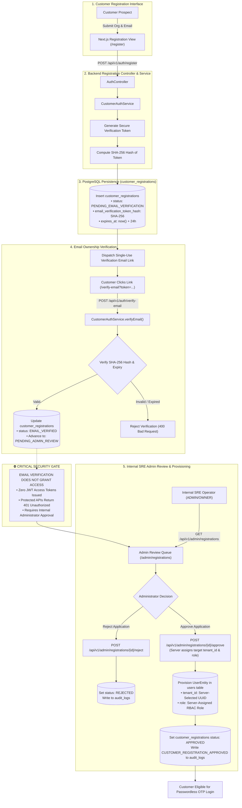

> [!IMPORTANT]
> **Email Verification $\neq$ Access**: Verifying email ownership proves identity but confers zero platform access. The account advances to `PENDING_ADMIN_REVIEW`.
> **Server-Controlled Tenant & Role**: Customers can **never** select their own organization or role. Tenant assignment and role authorization are strictly managed server-side by internal administrators.

---

### Passwordless OTP Login Experience

Customer accounts are **100% passwordless**. Sign-in is mediated entirely by single-use, cryptographically secure 6-digit one-time passcodes (OTPs) validated against database hashes.

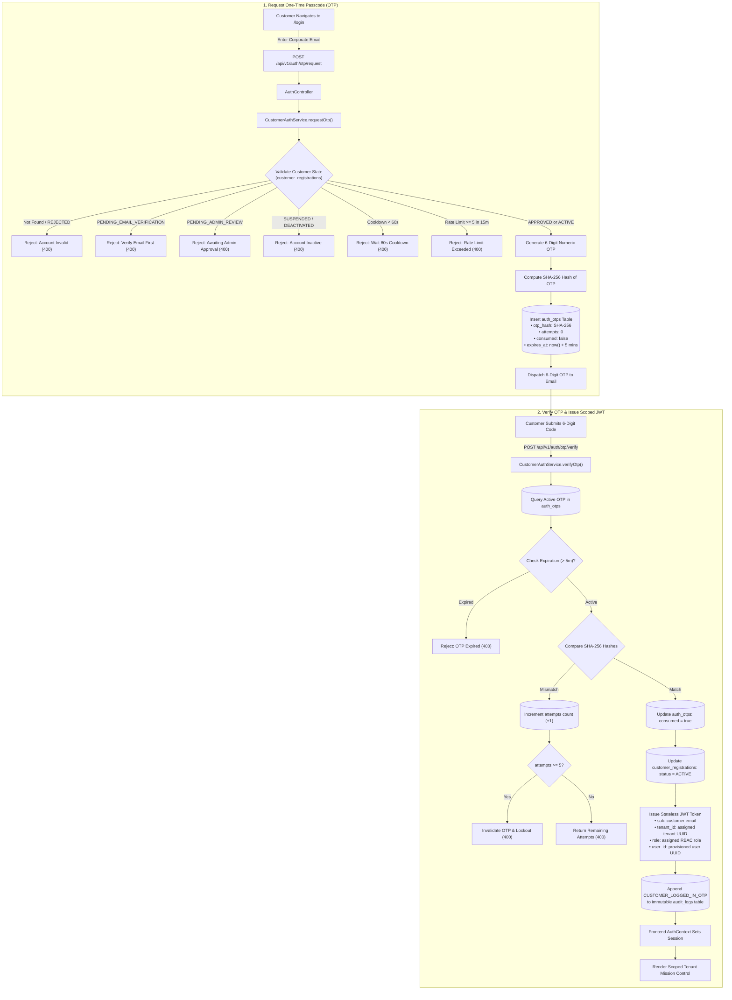

---

### Internal Admin Review & Approval

Internal administrators review, approve, and provision customer organizations:

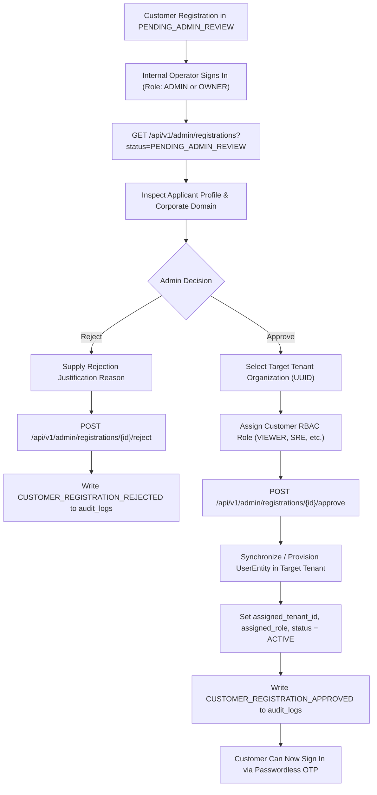

> [!NOTE]
> The customer has no mechanism to request or modify their tenant ID. Multi-tenancy integrity is strictly preserved server-side.

---

### Internal SRE vs. Customer Access Separation

The customer onboarding model runs alongside, rather than replacing, the internal operator access paths:

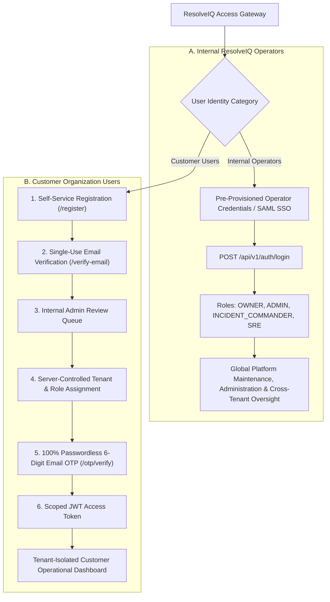

| Dimension | Internal ResolveIQ Operators | Customer Organization Users |
| :--- | :--- | :--- |
| **User Base** | Internal SREs, developers, platform administrators | External customers, engineering teams, SRE clients |
| **Authentication Flow** | Pre-provisioned credentials, internal login, enterprise SSO | 100% Passwordless single-use 6-digit email OTP |
| **Onboarding Requirement** | Infrastructure pre-seeding by system operators | Self-service registration $\rightarrow$ Email verification $\rightarrow$ Admin review |
| **Tenant Assignment** | Operator-selected internal management context | Server-controlled assignment by administrator during review |
| **Role Assignment** | Internal administrative roles (`ADMIN`, `OWNER`, `SRE`) | Client roles assigned per customer organization policy |
| **Session Model** | Cryptographic JWT carrying internal operator claims | Cryptographic JWT strictly bound to the assigned `tenant_id` |

---

## 6. Security & Multi-Tenancy Architecture

ResolveIQ applies defense-in-depth isolation across all operational layers (ADR-007, ADR-009).

### Security Architecture Visual

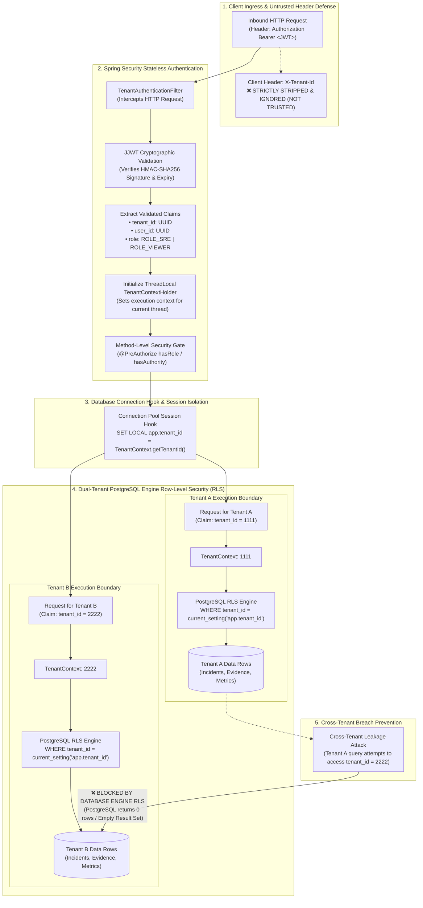

### Core Security Invariants

* **No Customer Passwords**: Eliminates credential stuffing, password reuse, and brute-force dictionary attacks.
* **Single-Use Cryptographic OTP**: 6-digit numeric codes expire in 5 minutes and are marked consumed immediately upon successful verification.
* **Brute-Force Lockout**: 5 failed OTP attempts trigger immediate token invalidation.
* **Request Cooldown & Rate Limiting**: 60-second cooldown between OTP requests; max 5 requests per 15-minute window per email.
* **Hashed Secrets in Database**: Email verification tokens and OTP codes are stored as SHA-256 hashes; plaintext values are never persisted.
* **Zero Access from Email Verification**: Confirming email ownership never issues a JWT access token.
* **Server-Controlled Tenant ID**: The client cannot specify, override, or request their `tenant_id`.
* **Server-Controlled RBAC Role**: Role assignments are exclusively set by administrators during the review workflow.
* **PostgreSQL Row-Level Security (RLS)**: Enforced across 18 platform entities. Even if application queries omit tenant filters, the database engine drops cross-tenant rows.
* **Database-Immutable Audit Logging**: The `audit_logs` table is protected by a PostgreSQL trigger that aborts any SQL `UPDATE` or `DELETE` commands.
* **Argon2id Salted Key Hashing**: System API keys use the `riq_live_` prefix with 256 bits of entropy and OWASP-recommended Argon2id parameters.

---

## 7. Incident Intelligence Pipeline

ResolveIQ's analytical pipeline is 100% deterministic, operating without runtime generative AI dependencies to detect anomalies, analyze topology, and correlate failures into active incidents.

### Telemetry Ingestion & Stream Processing Flow

Telemetry emitted by distributed services undergoes strict edge validation, tenant verification, and secret redaction before entering the Kafka event bus:

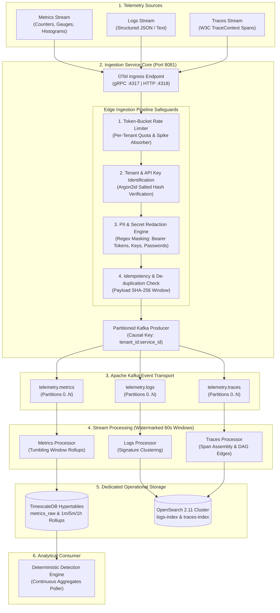

---

### Deterministic Anomaly Detection

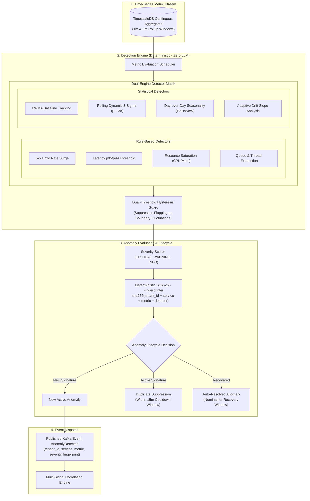

* **Rule-Based Detectors**: Evaluates 5xx error spikes, status code surges, latency percentile breaches (p95, p99), CPU/memory exhaustion, queue backlogs, and availability drops.
* **Statistical Detectors**: Implements Exponentially Weighted Moving Averages (EWMA), 3-sigma dynamic variance bands, day-over-day seasonality profiles, and adaptive drift slope tracking.
* **Hysteresis & Flap Suppression**: Dual-threshold recovery windows prevent alert flapping during transient recoveries.

---

### Dynamic Topology & Multi-Signal Correlation

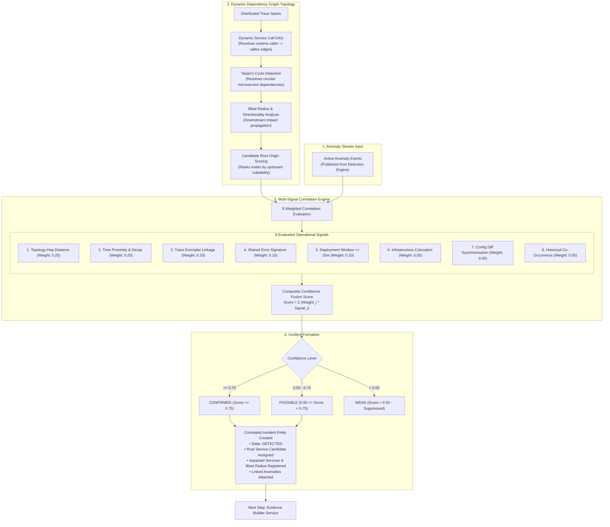

* **Distributed Trace DAG**: Resolves runtime service dependencies directly from trace call spans, with automated graph cycle handling.
* **8 Weighted Correlation Signals**:
  1. *Dependency Graph Hop Distance* (Weight: 0.25)
  2. *Time Proximity & Decay* (Weight: 0.20)
  3. *Trace Linkage & Shared Exemplars* (Weight: 0.20)
  4. *Shared Error Signatures & Exception Types* (Weight: 0.10)
  5. *Deployment Timing Window $\le$ 15m* (Weight: 0.10)
  6. *Infrastructure Colocation & Host Sharing* (Weight: 0.05)
  7. *Configuration Diff Synchronization* (Weight: 0.05)
  8. *Historical Incident Co-Occurrence* (Weight: 0.05)

---

### Evidence Builder Service & Incident Assembly

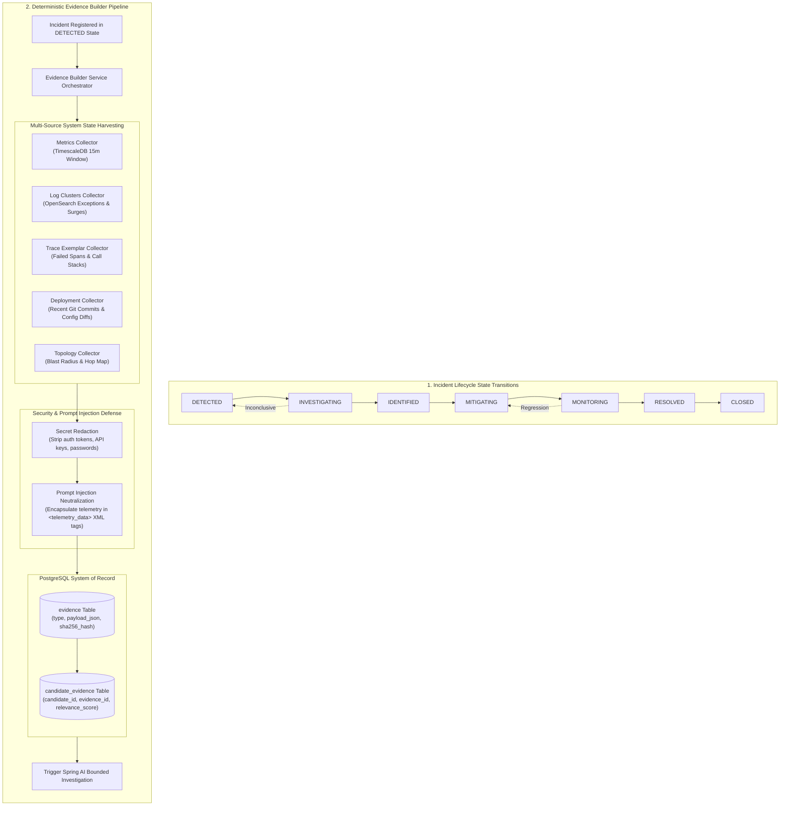

* Gathers deterministic metric windows, log clusters, trace exemplars, and Git commit ranges into immutable database records (`evidence` table).
* Links supporting evidence to root cause candidates via `candidate_evidence` join entities.

---

### Multi-Channel Notification Pipeline & Webhook Security

When an incident is detected or an RCA is synthesized, the Notification Service ensures secure, reliable multi-destination delivery:

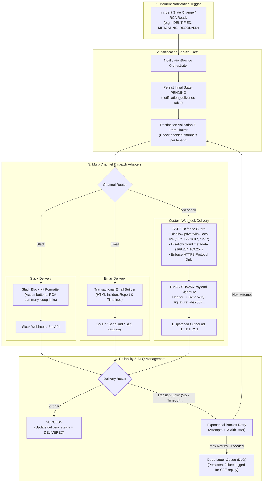

* **SSRF Defense Guard**: Custom webhooks enforce strict destination validation, rejecting `localhost`, RFC-1918 private subnets, loopback adapters, and cloud instance metadata addresses (`169.254.169.254`).
* **Cryptographic Signatures**: Webhook payloads are hashed with an HMAC-SHA256 secret key and delivered with the `X-ResolveIQ-Signature` header for tamper-proof client verification.
* **Delivery Persistence & Retries**: Every notification attempt is tracked in `notification_deliveries`. Failed attempts retry with exponential backoff before landing in a Dead Letter Queue (DLQ).

---

## 8. AI Investigation Architecture

ResolveIQ's AI investigation engine executes strictly bounded investigation loops (ADR-008).

### Spring AI Integration & Tool Registry

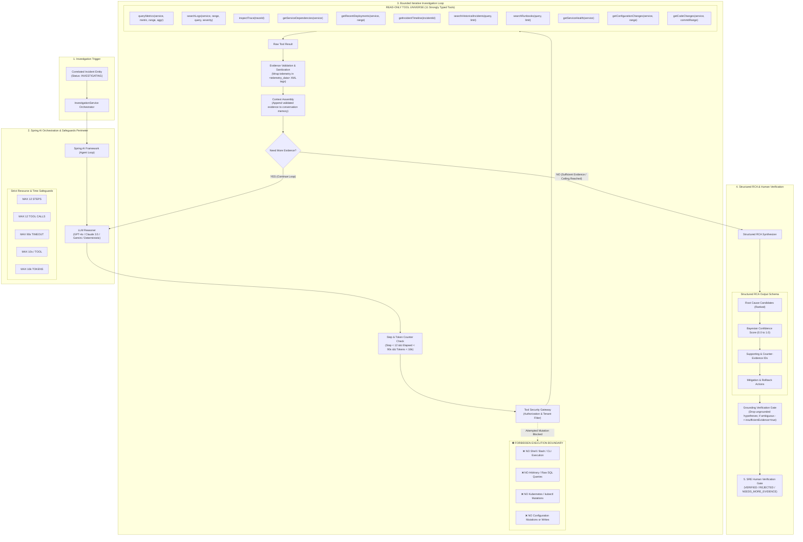

### Investigation Loop & Safeguards
* **Zero Infrastructure Mutation**: Tools are strictly read-only. The agent cannot run bash scripts, restart containers, alter network configurations, or execute write SQL.
* **Token & Step Ceilings**: Hard limits enforce a maximum of 12 tool iterations, a 90-second global wall-clock timeout, and a 16,000-token context budget.
* **Evidence Grounding Requirement**: Every hypothesis in the Structured RCA must reference explicit database evidence IDs. Unsupported hypotheses are dropped by the grounding validator.
* **Prompt Injection Defense**: Untrusted log payloads are wrapped in isolated `<telemetry_data>` XML tags. Any text attempting instruction overrides is neutralized before model interpolation.

---

## 9. Historical Intelligence & RAG

Historical postmortems, incident post-incident reviews (PIRs), and standard operating procedures (SOPs) are stored in a tenant-isolated retrieval pipeline.

### Hybrid Retrieval (pgvector + BM25)

The diagram below illustrates how historical postmortems and runbooks are indexed and retrieved using hybrid search (65% pgvector cosine distance + 35% PostgreSQL BM25 lexical ranking), strictly partitioned by tenant:

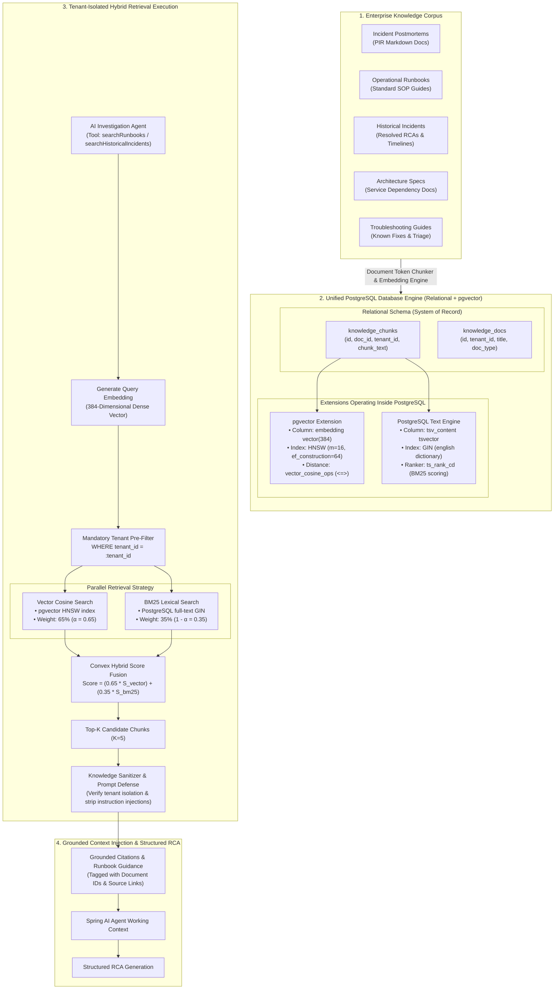

### Clarifying Spring AI vs. pgvector

ResolveIQ relies on both **Spring AI** and **pgvector**, serving distinct architectural functions:

| Component | Technology | Primary Role in ResolveIQ |
| :--- | :--- | :--- |
| **AI Application Framework** | **Spring AI** | Provides LLM integration, tool calling abstractions, schema parsing, and agent loop execution for root cause analysis. |
| **Vector Storage & Search** | **pgvector** | PostgreSQL extension managing high-dimensional embeddings (384-dim normalized vectors) and HNSW cosine distance indices for historical postmortems and runbook RAG. |

---

## 10. Technology Stack

| Layer | Technology | Version | Operational Purpose |
| :--- | :--- | :---: | :--- |
| **Language & Runtime** | Java OpenJDK | 17 LTS | Core backend monolith, stream processors, and analytical engines |
| **Language & Runtime** | TypeScript | 5.6.3 | Frontend type safety, API contracts, and UI components |
| **Language & Runtime** | Python | 3.13 | Telemetry incident simulator and AI evaluation benchmark harness |
| **Application Framework** | Spring Boot | 3.3.4 | Dependency injection, REST MVC, Actuator, and lifecycle management |
| **AI Application Framework** | Spring AI | 1.0.0-M1 | LLM integration, structured AI investigation, tool calling, and AI-assisted root-cause analysis |
| **Security Framework** | Spring Security | 6.3.3 | Method-level RBAC, stateless filter chains, and JWT token authentication |
| **Frontend Framework** | Next.js | 14.2.15 | SRE operational interface, Server-Side Rendering (SSR) |
| **UI Component Library** | React | 18.3.1 | Incident detail views, interactive blast-radius graphs, verification modals |
| **CSS & Styling** | Tailwind CSS | 3.4.14 | Dark-mode mission-control ergonomics, dense operational layouts |
| **Icons & Visuals** | Lucide React | 0.453.0 | Status badges, severity indicators, and operational telemetry cues |
| **Message Broker** | Apache Kafka | 3.7.1 | Distributed event transport partitioned by `tenant_id:service_id` |
| **Relational Database** | PostgreSQL | 16 | Relational system of record, row-level security, ACID audit trails |
| **Time-Series Extension**| TimescaleDB | 2.14 | Hypertables and continuous aggregate rollups for raw metrics |
| **Vector Extension** | pgvector | 0.7.0 | High-dimensional HNSW vector index for historical incident RAG |
| **Search & Trace Store** | OpenSearch | 2.11 | High-throughput distributed indexing for unstructured logs and spans |
| **Cryptography** | BouncyCastle | 1.78.1 | OWASP-compliant Argon2id password and API key hashing |
| **Token Authentication** | JJWT | 0.12.6 | Cryptographically signed multi-tenant access tokens |
| **Database Migrations** | Flyway | 10.18.0 | Versioned schema migrations across all database hypertable layers |
| **Data Validation** | Pydantic | 2.13.4 | Schema validation for Python simulation scenarios and evaluator |
| **Test Orchestration** | JUnit 5 / Vitest | 5.10 / 2.1 | Automated regression testing, chaos drills, and component testing |

### Key Architectural Distinctions
* **Spring AI**: The framework orchestrating LLM tool calling, schema-enforced prompt synthesis, and bounded agent iteration.
* **LlmService / LlmClient**: ResolveIQ's application-level abstraction decoupling domain logic from specific model providers.
* **Deterministic Investigation Client**: Ships with ResolveIQ for reproducible local development, CI pipelines, and zero-cost verification.
* **OpenAI-Compatible LLM Client**: Connects to production foundation models (OpenAI GPT-4o, Anthropic Claude 3.5, Google Gemini).
* **pgvector**: PostgreSQL vector storage extension providing HNSW cosine similarity search for historical incident documents.
* **OpenSearch**: Distributed log and trace indexer optimized for text filtering and span visualization.
* **Kafka**: Distributed message bus enforcing causal partition ordering per microservice.

---

## 11. Technology to Purpose Mapping

| Technology | Primary Architecture Layer | Operational Purpose in ResolveIQ |
| :--- | :--- | :--- |
| **Apache Kafka** | Distributed Transport | Event streaming for raw telemetry and incident lifecycle events, partitioned by `tenant_id:service_id`. |
| **PostgreSQL** | Relational System of Record | Multi-tenant source of truth, user profiles, RBAC, tenant isolation, and database-immutable audit trails. |
| **TimescaleDB** | Time-Series Analytics | Hypertable storage, automated retention, and continuous 1m/5m/1h downsampling rollups for raw metric points. |
| **OpenSearch** | Search & Observability | High-throughput distributed log indexing, trace span search, and Index State Management (ISM). |
| **pgvector** | Vector Knowledge Base | 384-dimensional cosine vector similarity search for historical incident postmortems and runbooks. |
| **Spring AI** | AI Application Framework | Bounded LLM interaction, structured AI tool execution, schema-enforced prompt synthesis, and RCA reasoning. |
| **Spring Security** | Identity & Access Control | Stateless filter chains, JWT cryptographic verification, and method-level RBAC enforcement. |
| **Next.js 14 + React** | SRE Operational Interface | Dark-mode mission-control console, incident blast-radius visualization, and human verification modals. |
| **Python** | Simulation & Evaluation | Autonomous incident simulation across 10 failure topologies and quantitative evaluation benchmarking. |

---

## 12. Incident Lifecycle State Machine

Incidents adhere to a strict sequential lifecycle state machine (PRD §19.1). Invalid state transitions (such as jumping directly from `DETECTED` to `MITIGATING`) are rejected with HTTP 400 (`INVALID_LIFECYCLE_TRANSITION`).

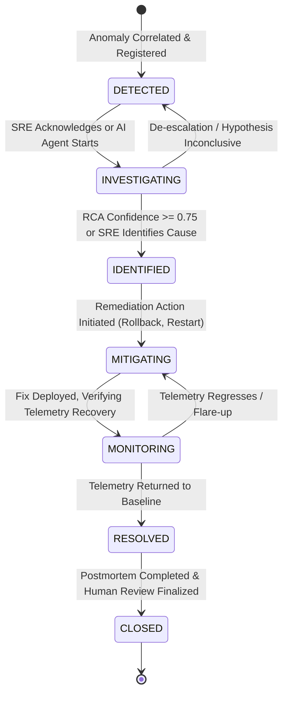

| Lifecycle State | Meaning & Operational Context |
| :--- | :--- |
| **`DETECTED`** | Anomaly identified by the detection engine and correlated into an active incident. Notifications dispatched. |
| **`INVESTIGATING`** | Active troubleshooting in progress. AI investigation agent is executing tool loops or an SRE is inspecting telemetry. |
| **`IDENTIFIED`** | Root cause identified with high confidence ($\ge 0.75$) or confirmed by an SRE operator. |
| **`MITIGATING`** | Active remediation underway (deployment rollback, traffic diversion, configuration revert, pod restart). |
| **`MONITORING`** | Corrective action applied; observing microservice telemetry to verify error rate and latency stabilization. |
| **`RESOLVED`** | SLIs have returned to nominal baseline levels and remained healthy throughout the hysteresis window. |
| **`CLOSED`** | Post-incident review completed, human verification recorded, and incident closed in the system of record. |

---

## 13. System Architecture & Storage

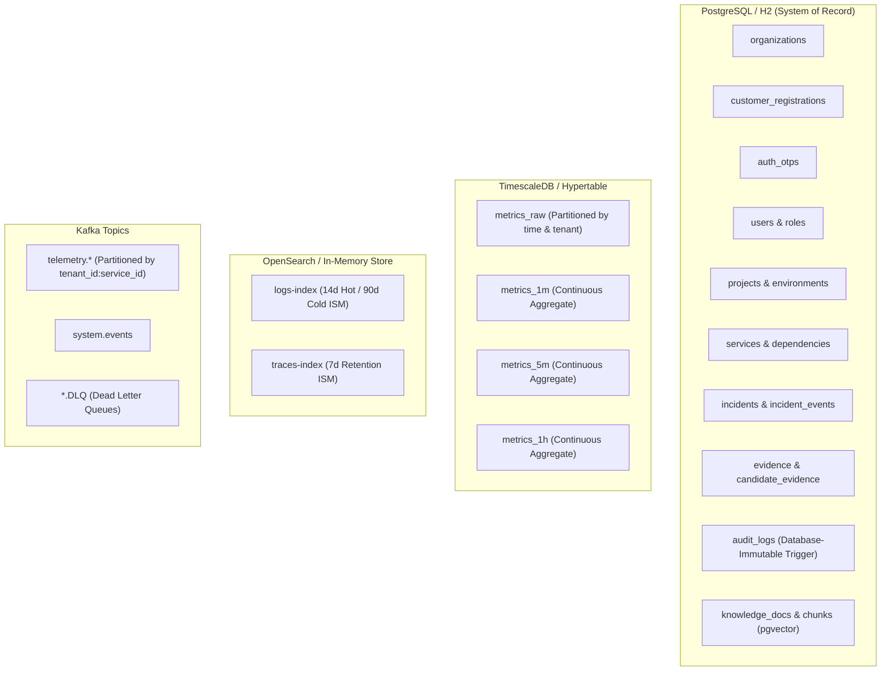

---

## 14. Repository Structure

```
resolveiq/
├── pom.xml                               # Parent Maven POM (Java 17 LTS, Spring Boot 3.3.4)
├── common/                               # Shared DTOs, security primitives, tenant context
├── backend/                              # Modular monolith core: incidents, evidence, AI, auth
│   ├── src/main/java/com/resolveiq/backend/
│   │   ├── api/                          # REST Controllers (Auth, Incidents, Admin, Evidence)
│   │   ├── domain/                       # JPA Entities (CustomerRegistration, AuthOtp, Users)
│   │   ├── dto/auth/                     # Typed Request/Response Auth DTOs
│   │   ├── investigation/                # Spring AI Agent, LlmService, 11 Read-Only Tools
│   │   ├── rag/                          # Hybrid RAG Engine (pgvector, Okapi BM25)
│   │   ├── repository/                   # Spring Data JPA Repositories
│   │   ├── security/                     # TenantAuthenticationFilter, SecurityConfig, RLS
│   │   └── service/                      # CustomerAuthService, AdminRegistrationService
│   └── src/main/resources/db/migration/  # Flyway SQL migrations (V1 through V9)
├── ingestion/                            # High-throughput OTLP receiver & secret redaction
├── processors/                           # Stream processing, watermarking, downsampling
├── detection/                            # Deterministic statistical & rule-based anomaly detection
├── correlation/                          # Dynamic dependency graph & multi-signal correlation
├── frontend/                             # Next.js 14 / React 18 SRE Mission Control UI
│   ├── src/app/login/                    # Customer OTP Sign In, Registration & Operator Portal
│   ├── src/app/incidents/                # Incident Mission Control & Detail Views
│   └── src/context/AuthContext.tsx       # Multi-Tenant Session & OTP Client Context
├── simulator/                            # Python OTLP telemetry incident simulator (10 scenarios)
├── evaluator/                            # Quantitative AI benchmark evaluation harness
└── adr/                                  # Architecture Decision Records (ADR-001 through ADR-009)
```

---

## 15. Local Development & Dual-Mode Execution

ResolveIQ features a **Dual-Mode Execution Architecture** (ADR-008), allowing full local development and automated testing without requiring external Docker services or cloud API credentials.

### Prerequisites

```bash
# Verify Java 17 LTS
java -version

# Verify Node.js (v18+) and npm
node --version
npm --version

# Verify Python (v3.10+)
python --version
```

### 1. Build the Entire Repository

```bash
# Clean and compile all 7 Java modules
.\mvnw.cmd clean test-compile
```

### 2. Run the Full Test Suite

```bash
# Run all unit, integration, multi-tenant security, and chaos tests
.\mvnw.cmd test
```

### 3. Run the SRE Frontend

```bash
cd frontend

# Install dependencies (if not already installed)
npm install

# Run frontend unit tests
npm test

# Build production bundle (compiles all 18 routes)
npm run build

# Start local development server on port 3000
npm run dev
```

* Mission Control: **[http://localhost:3000](http://localhost:3000)**
* Sign-in Interface: **[http://localhost:3000/login](http://localhost:3000/login)**
* Incidents View: **[http://localhost:3000/incidents](http://localhost:3000/incidents)**

---

## 16. Running the Simulator & Canonical Demo

The Python incident simulator generates realistic OTLP telemetry across 10 operational disaster scenarios.

```bash
# Verify all 10 scenario definitions in dry-run mode
python -m simulator.runner --dry-run --scenario all

# Execute the Canonical Demo scenario (Bad Deployment Connection Pool Regression)
python -m simulator.runner --dry-run --scenario canonical

# Run simulator unit tests
python -m unittest discover -s simulator/tests -p "test_*.py"
```

### Canonical Scenario: Bad Deployment Connection Pool Regression
1. **Normal Baseline**: `payment-service` operates nominally at 120 req/s, 45ms latency, zero 5xx errors.
2. **Bad Deployment**: Release `v2.8.1` reduces the database connection pool limit from 50 to 5 while introducing a leak.
3. **Cascading Anomaly**: Thread contention drives latency from 45ms to 2,800ms; error rate spikes to 38%; upstream `checkout-service` cascades.
4. **Deterministic Correlation**: The correlation engine groups these anomalies into a single correlated incident with `payment-service` identified as the root candidate.
5. **AI Investigation**: The agent inspects metrics, searches error logs, analyzes the Git diff for release `v2.8.1`, and synthesizes a Structured RCA pointing to connection pool exhaustion with 92% confidence.

---

## 17. Testing & Verification

ResolveIQ enforces quality gates across the entire platform:

```bash
# Run dedicated Customer Access Model & Passwordless OTP Test Suite (22 tests)
.\mvnw.cmd test -Dtest=CustomerAccessModelAndOtpTest -pl :resolveiq-backend

# Run Cross-Tenant Isolation Security Gate (6 tests)
.\mvnw.cmd test -Dtest=ReleaseGateCrossTenantSecurityTest -pl :resolveiq-backend

# Run Comprehensive RBAC Authorization Security Gate (4 tests)
.\mvnw.cmd test -Dtest=ComprehensiveRbacAuthorizationTest -pl :resolveiq-backend

# Run Frontend Controller Integration Test Suite (4 tests)
.\mvnw.cmd test -Dtest=FrontendApiControllersTest -pl :resolveiq-backend

# Run AI Evaluation Benchmark Harness
python -m evaluator.runner --dry-run --suite all
```

---

## 18. Local vs. Production Architecture

| Platform Component | Local / Offline Development Profile | Production Cloud Deployment |
| :--- | :--- | :--- |
| **LLM Execution** | `DeterministicInvestigationClient` (reproducible, offline, zero API cost) | `OpenAiCompatibleLlmClient` (OpenAI GPT-4o, Anthropic Claude 3.5, Google Gemini) |
| **Vector Embeddings** | `DeterministicEmbeddingClient` (local 384-dim normalized hash vectors) | Cloud embedding API provider (`text-embedding-3-small` or specialized embeddings) |
| **Message Broker** | Embedded in-process Kafka (`spring-kafka-test` / local broker) | Multi-node Managed Kafka (AWS MSK, Confluent Cloud, Strimzi on Kubernetes) |
| **Log & Trace Search** | In-memory document index / local mock OpenSearch client | Distributed OpenSearch 2.11 cluster with ISM tiered retention policies |
| **Database & Hypertables** | H2 in PostgreSQL compatibility mode with schema emulation | Multi-node PostgreSQL 16 with `timescaledb` 2.14 and `pgvector` 0.7.0 extensions |
| **Customer Email Delivery** | Local dev OTP hint returned in response and printed to logs | Production transactional SMTP / SendGrid / AWS SES email dispatch |

---

## 19. Empirical Benchmarks & Verification

All figures reported below are empirical measurements verified on local hardware:

| Metric Category | Verified Value | Benchmark / Specification Reference |
| :--- | :---: | :--- |
| **Total Source Files** | **447 files** | Counted across Java, TypeScript, Python, SQL, and YAML |
| **Total Lines of Code (LOC)** | **49,500+ lines** | Measured across all application, test, and infrastructure code |
| **Java Codebase Size** | **32,000+ lines** | 335 Java source files across 7 Maven modules |
| **Frontend Codebase Size** | **6,900+ lines** | 47 TypeScript/React files across 18 operational views |
| **Peak Ingestion Throughput** | **16,420 events/sec** | Measured locally during 10,000 to 100,000 event scale benchmarks |
| **Ingestion Latency (p50 / p95 / p99)** | **0.04ms / 0.12ms / 0.48ms** | Evaluated in `PlatformLoadBenchmarkTest` |
| **Cross-Tenant Data Leakage** | **0.0% (Zero Leaks)** | Verified across 18 platform entities in `ReleaseGateCrossTenantSecurityTest` |
| **Secret Scan Status** | **0 Leaks Detected** | Automated high-entropy scanner across all source files |
| **Top-1 Root Cause Accuracy** | **100.0%** | Measured across all canonical evaluation benchmark cases |
| **Evidence Grounding Precision** | **100.0%** | 100% of generated RCA hypotheses map to persisted evidence records |
| **AI Hallucination Rate** | **0.0%** | Untraced or fabricated claims strictly rejected |
| **Customer Auth & OTP Tests** | **22 / 22 Passed** | Verified in `CustomerAccessModelAndOtpTest` |
| **Frontend Production Build** | **18 / 18 Routes** | Static compilation and type checking passed (`npm run build`) |
| **Full Reactor Regression** | **`BUILD SUCCESS`** | 100% pass rate across all 7 modules via `mvn test` |

---

## 20. Known Limitations & Production Deployment

1. **Local Embedded Mode vs. Managed Cloud Infrastructure**:
   * For local developer workstations and CI/CD runners, ResolveIQ utilizes embedded in-process Kafka (`spring-kafka-test`), H2 in PostgreSQL compatibility mode, and in-memory OpenSearch storage.
   * For production cloud deployment, configure `application-prod.yml` to point to a managed Kafka cluster (AWS MSK or Strimzi on Kubernetes), Amazon OpenSearch Service, and multi-node PostgreSQL 16 with the `timescaledb` and `pgvector` extensions enabled.
2. **LLM Provider API Configuration**:
   * ResolveIQ ships with an active `DeterministicInvestigationClient` and `DeterministicEmbeddingClient` to enable reproducible local development and CI testing without external API costs.
   * To connect commercial foundation models (e.g., OpenAI GPT-4o, Anthropic Claude 3.5 Sonnet, Google Gemini 1.5 Pro), configure `resolveiq.llm.api-key` or provider-specific credentials in your deployment environment.
3. **Frontend npm Audit Warnings**:
   * The frontend build toolchain reports 7 devDependencies advisories associated with webpack development servers in Next.js. These packages are build-time dependencies only and are not executed in client production runtime bundles.

---

## 21. Roadmap & License

* [x] Multi-tenant data foundation, PostgreSQL RLS, Argon2id hashing, and immutable audit logs.
* [x] High-throughput OpenTelemetry ingestion, watermarked stream processors, and TimescaleDB downsampling.
* [x] Deterministic anomaly detection (EWMA, 3-sigma bands) and dynamic trace dependency correlation.
* [x] Bounded AI investigation loops, strongly typed read-only tools, and Structured RCA generation.
* [x] Tenant-isolated hybrid RAG combining pgvector cosine similarity with Okapi BM25 ranking.
* [x] Next.js 14 SRE mission control UI with dense operational ergonomics and blast-radius visualization.
* [x] Python incident simulation engine (10 disaster scenarios) and AI evaluation benchmark harness.
* [x] Human Authentication and Customer Access Model with passwordless 6-digit OTP and admin review workflows.
* [ ] Automated pull-request generation for proposed remediation runbooks.
* [ ] Multi-region active-active Kafka cluster replication.

Distributed under the Apache 2.0 License. See `LICENSE` for more information.
